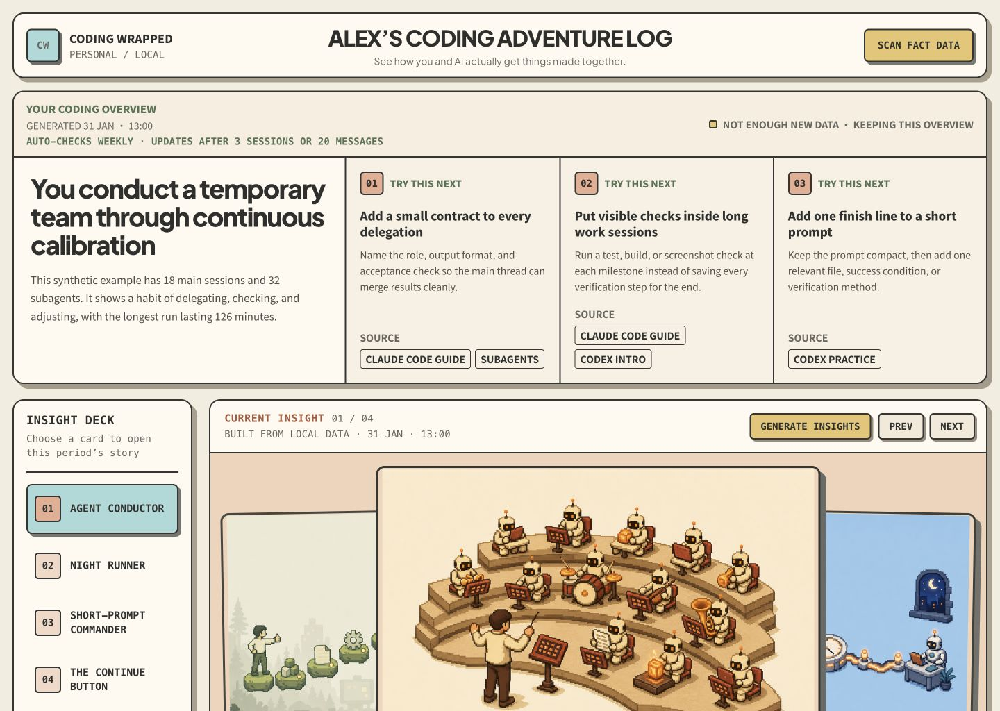
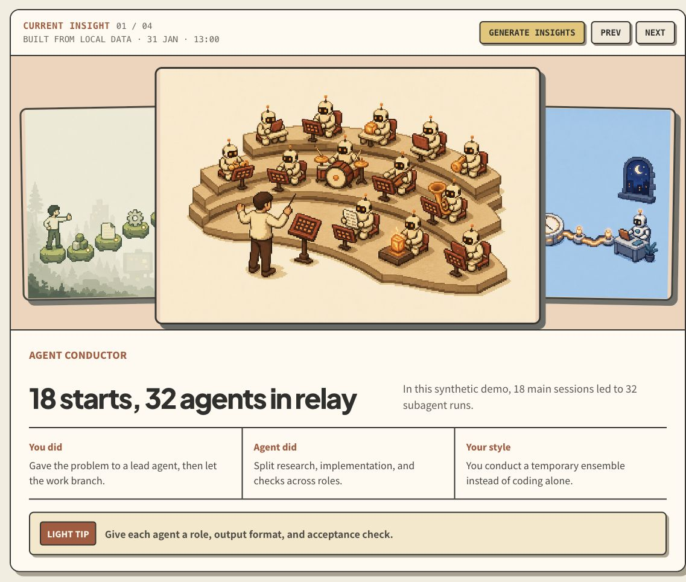
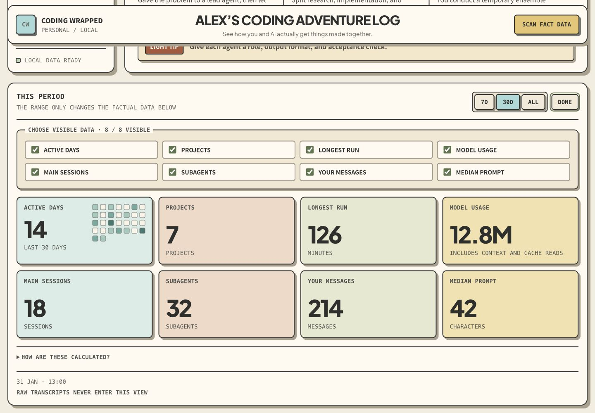
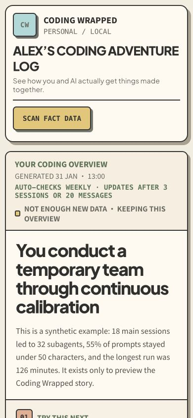

# Coding Wrapped

[](#claude-code-and-codex--one-command)
[](#claude-code-and-codex--one-command)
[](skills/coding-wrapped/SKILL.md)
[](LICENSE)

**Your coding agents remember more than you think.**

Coding Wrapped turns local Claude Code and Codex history into a private,
pixel-art dashboard about how you work with AI: when you code, how you prompt,
how the agent responds, and what kind of builder you are becoming.

[中文说明](README.zh-CN.md)



## What it makes

- A local dashboard with active days, sessions, projects, model mix, tool use,
  prompt rhythm, and longest focused run.
- A short **Coding Overview** that explains your overall working pattern.
- Playful illustrated insights organized as **You did / Agent did / Your
  style**, plus one practical suggestion.
- Four persistent insights per generation, each with a different pixel-art
  composition.
- A portable local export you can archive or share intentionally.

It is **not** a transcript viewer, productivity score, employee-monitoring
tool, or cloud analytics service.

## See the complete experience

Every screenshot below uses deterministic synthetic data. The dashboard text is
native HTML, while the pixel-art illustration is generated and stored locally.

### One insight, end to end

An insight is more than its illustration. Each card includes the behavior that
triggered it, how the agent responded, the working style it suggests, and one
practical next step.



### Customizable coding behavior

The factual section can show up to eight modules. People choose which modules
remain visible; the responsive grid reflows around that selection.



### Four distinct visual stories


### Responsive local dashboard

The same Overview, insights, and data remain usable on a narrow screen.



## Install

### Claude Code and Codex — one command

```bash
npx skills add senlindesign/coding-wrapped \
  --skill coding-wrapped \
  --agent claude-code \
  --agent codex \
  --global
```

The open Agent Skills package is the same on both platforms. No separate
Claude and Codex logic is maintained.

### Claude Code plugin marketplace

```text
/plugin marketplace add https://github.com/senlindesign/coding-wrapped
/plugin install coding-wrapped@coding-wrapped
```

### Manual install

Clone the repository, then copy `skills/coding-wrapped` to one or both folders:

```text
~/.claude/skills/coding-wrapped
~/.agents/skills/coding-wrapped
```

## Use

Start a fresh agent conversation and say:

```text
Build my Coding Wrapped from my local coding history.
```

Chinese works too:

```text
读取我本地的 Claude Code 和 Codex 记录，生成我的 Coding Wrapped。
```

The Skill infers the interface language from that prompt. On a normal first
run it asks at most for a short display name and scan permission when permission
was not already explicit.

It then:

1. scans standard local Claude Code and Codex session folders;
2. stores only safe aggregate metrics;
3. writes a Coding Overview and four insights;
4. opens the dashboard on `http://127.0.0.1:4173/`;
5. gives a short built-in manual.

Later you can ask:

```text
Refresh the facts without changing my insights.
Generate four new insights for this month.
Export my Coding Wrapped.
```

## What stays local

The scanner reads standard session directories on your machine, but generated
state excludes raw transcripts, source code, project names, file paths, email
addresses, URLs, and secrets. The dashboard binds to loopback only. See
[PRIVACY.md](PRIVACY.md) for the exact boundary.

## How the repository is organized

| Path | Purpose | Loaded when |
| --- | --- | --- |
| `skills/coding-wrapped/SKILL.md` | Core workflow and hard rules | Whenever the Skill triggers |
| `skills/coding-wrapped/references/` | Privacy, data, writing, and visual contracts | Only for the relevant phase |
| `skills/coding-wrapped/scripts/` | Deterministic scan, persistence, serve, and export logic | Executed as needed |
| `skills/coding-wrapped/assets/` | Offline dashboard, fonts, and fallback illustrations | Copied into local state |
| `.claude-plugin/` | Claude Code plugin and marketplace metadata | Installation only |
| `.codex-plugin/` | Codex plugin metadata | Installation only |
| `evals/` | Synthetic privacy and behavior checks | Development and release |

There is one canonical Skill folder. Platform manifests are thin adapters, so
Claude Code and Codex cannot drift into different products.

## Validate and package

Python 3.9+ is the only runtime requirement.

```bash
make validate
make package
```

`make validate` checks both platform manifests, compiles every Python file,
runs the Skill evaluator, and verifies the release layout. `make package`
creates `dist/coding-wrapped.skill`.

## Design principles

1. **Local first.** The most personal coding data should not require an account
   or hosted analytics service.
2. **Facts before stories.** Every playful claim must be traceable to an
   aggregate metric.
3. **Fun before judgment.** The point is recognition, not a score.
4. **Show, do not interrogate.** Build a useful first version before asking the
   user to configure themes and metrics.
5. **One map, details on demand.** The main Skill stays short; fragile rules and
   reusable assets live in the files that need them.

## Contributing

Read [CONTRIBUTING.md](CONTRIBUTING.md), then run `make validate` before opening
a pull request.

## License

[MIT](LICENSE). Bundled font licenses are listed in
[THIRD_PARTY_NOTICES.md](THIRD_PARTY_NOTICES.md).
