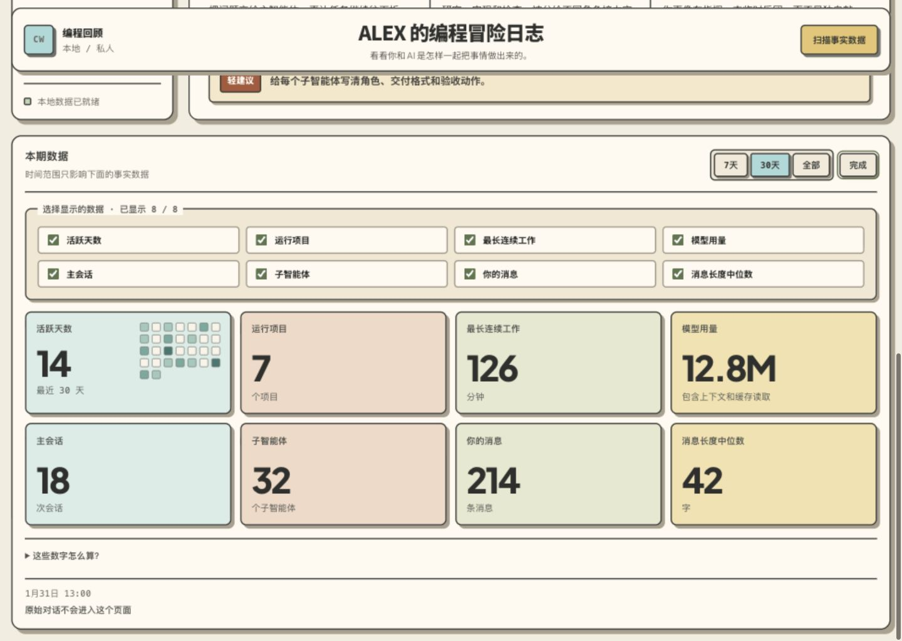

# Coding Wrapped

[](#claude-code-和-codex一条命令)
[](#claude-code-和-codex一条命令)
[](skills/coding-wrapped/SKILL.md)
[](LICENSE)

**你的 Coding Agent，其实记得很多。**

Coding Wrapped 会读取本地的 Claude Code 和 Codex 记录，把你与 AI
一起工作的方式做成一个私密的像素风 Dashboard：你通常什么时候写代码，
怎样下指令，Agent 如何回应，以及你正在形成什么样的协作风格。

[English](README.md)


## 它会生成什么

- 一组事实数据：活跃天数、会话数、项目数、模型使用、工具使用、提示词
  节奏和最长连续工作时间。
- 一段两句话的 **Coding 总览**：只选择两到三个最有代表性的事实，再说明
  它们反映出的整体协作习惯。
- 多张有趣的洞察：**你怎么做 / Agent 如何回应 / 你的风格**，再加一条
  有依据的轻建议。建议会从 40 条经过筛选的官方与一线实践中匹配，并附上
  对应来源。
- 每次生成四条洞察，每张采用不同构图，但遵循同一套由参考图约束的像素
  视觉语言，并会保存在本地。
- 一个可以归档或主动分享的本地导出包。

它**不是**原始对话浏览器、生产力评分、员工监控工具或云端分析服务。

## 看完整的产品内容

以下截图全部使用确定性的合成数据。Dashboard 中的文字由原生 HTML
渲染，只有像素插画会生成并保存在本地。

### 一条完整的 Insight

Insight 不只是一张插画。每张卡还会解释触发它的行为、Agent
如何回应、它反映出的协作风格，以及一条可以立刻尝试的轻建议。


### 可以自定义的 Coding behavior 数据

事实数据区最多包含八个模块。用户可以选择需要显示的内容，响应式网格会
根据模块数量自动重排。



### 四种不重复的视觉故事


## 安装

### Claude Code 和 Codex：一条命令

```bash
npx skills add senlindesign/coding-wrapped \
  --skill coding-wrapped \
  --agent claude-code \
  --agent codex \
  --global
```

两个平台读取的是同一份开放 Agent Skill，不需要维护两套逻辑。

### Claude Code 插件市场

```text
/plugin marketplace add https://github.com/senlindesign/coding-wrapped
/plugin install coding-wrapped@coding-wrapped
```

### 手动安装

Clone 仓库，再把 `skills/coding-wrapped` 复制到以下一个或两个目录：

```text
~/.claude/skills/coding-wrapped
~/.agents/skills/coding-wrapped
```

## 使用

打开一个新的 Agent 对话，直接说：

```text
读取我本地的 Claude Code 和 Codex 记录，生成我的 Coding Wrapped。
```

Skill 会根据这句话自动确定界面语言。正常首次运行最多只会确认昵称，以及
在你没有明确要求扫描时确认一次读取权限。

接下来它会：

1. 扫描标准的 Claude Code 和 Codex 本地会话目录；
2. 只保存安全的汇总指标；
3. 生成 Coding 总览和四条洞察；
4. 在 `http://127.0.0.1:4173/` 打开 Dashboard；
5. 给出一份很短的使用说明。

之后可以继续说：

```text
只刷新事实数据，不要改变洞察。
根据本月数据再生成四条新洞察。
导出我的 Coding Wrapped。
```

## 哪些内容留在本地

扫描器会读取你电脑上的标准会话目录，但生成后的状态不会包含原始对话、
源代码、项目名、本地路径、邮箱、URL 或密钥。网站只监听本机回环地址。
完整边界见 [PRIVACY.md](PRIVACY.md)。

## 仓库结构

| 路径 | 作用 | 何时读取 |
| --- | --- | --- |
| `skills/coding-wrapped/SKILL.md` | 核心流程与硬规则 | Skill 被触发时 |
| `skills/coding-wrapped/references/` | 隐私、数据、文案和视觉规范 | 对应阶段才读取 |
| `skills/coding-wrapped/references/coding-best-practices.md` | 用于匹配轻建议的 Best Practice 事实源 | 生成总览或 Insight 建议时 |
| `skills/coding-wrapped/scripts/` | 扫描、持久化、本地服务和导出 | 按需执行 |
| `skills/coding-wrapped/assets/` | 离线网站、字体和后备插画 | 初始化本地状态时 |
| `skills/coding-wrapped/assets/frontend-source/` | Dashboard 的 React 与 CSS 可编辑源文件 | 只有重建界面时 |
| `.claude-plugin/` | Claude Code 插件与市场清单 | 仅安装时 |
| `.codex-plugin/` | Codex 插件清单 | 仅安装时 |
| `evals/` | 合成隐私与行为测试 | 开发和发布时 |

仓库里只有一份核心 Skill。Claude Code 和 Codex 的清单只是很薄的平台
适配层，避免两个版本逐渐走向不同的产品。

## 验证与打包

唯一运行要求是 Python 3.9+。

```bash
make validate
make package
```

`make validate` 会校验两个平台的清单、编译所有 Python 文件、运行 Skill
评测并检查发布结构。`make package` 会生成
`dist/coding-wrapped.skill`。

只有修改 Dashboard 界面的贡献者需要 Node.js。可通过以下命令从已提交的
源文件重建带 hash 的离线前端：

```bash
npm --prefix skills/coding-wrapped/assets/frontend-source ci
make frontend
```

## 五条设计原则

1. **本地优先。** 最个人的 Coding 数据不应该先注册一个云端服务。
2. **先有事实，再讲故事。** 每条有趣洞察都必须能回到汇总数据。
3. **有趣优先，不做评判。** 目标是让用户认出自己，不是给用户打分。
4. **先给东西看，不先做问卷。** 先生成一个有用的版本，再让用户调整。
5. **一张地图，按需展开。** 主 Skill 保持简短，脆弱规则和可复用素材放到
   对应文件。
6. **一套视觉契约。** 每张生成插画都必须绑定四张 canonical reference
   之一，并遵循相同的像素密度、角色语言、画布和构图规则。

## 参与开发

阅读 [CONTRIBUTING.md](CONTRIBUTING.md)，提交 Pull Request 前运行
`make validate`。

### Landing Page

公开产品演示位于 [`landing/`](landing/)。它是一个不依赖后端的静态 Vite
页面，所有数据都是合成数据。四张洞察插画来自经过批准的 fallback 参考图的
网页优化版本，不包含任何真实用户的会话汇总。

```bash
npm --prefix landing install
npm --prefix landing run dev
make landing-test
```

正式网站使用 Cloudflare Workers Static Assets 部署。在 `landing/` 目录中，
`npm run deploy:check` 会完成发布前验证但不真正上线，`npm run deploy` 会发布
已经构建好的页面。配置 Cloudflare Workers Builds 时，Root directory 使用
`landing/`，Build command 使用 `npm run build`，Deploy command 使用
`npm run deploy`。

外部链接统一配置在 `landing/src/content.js`。在提供经过确认的 Buy Me a
Coffee 地址之前，支持按钮会保持为说明状态，不会链接到错误的收款页面。

## License

[MIT](LICENSE)。内置字体的授权说明见
[THIRD_PARTY_NOTICES.md](THIRD_PARTY_NOTICES.md)。
