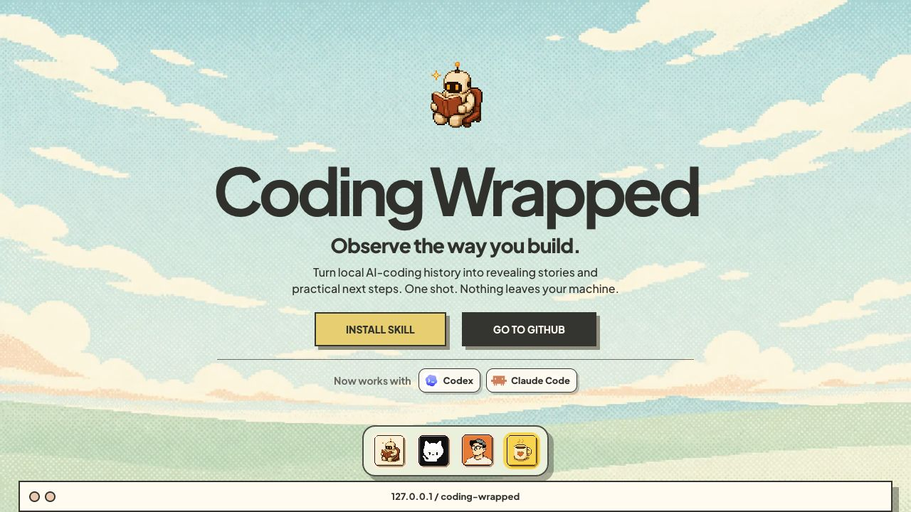
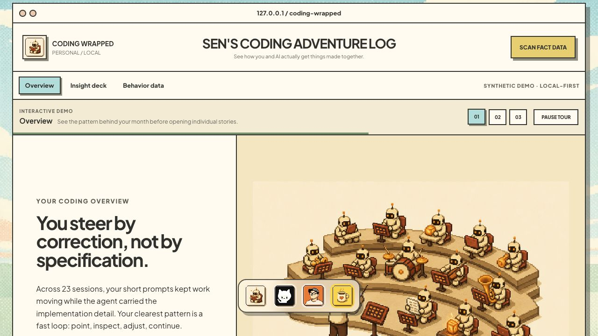
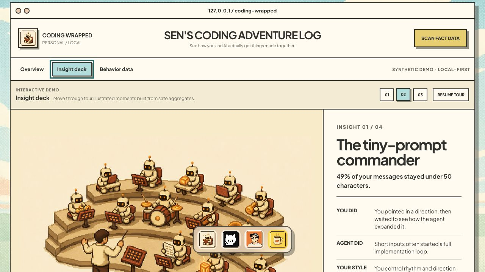
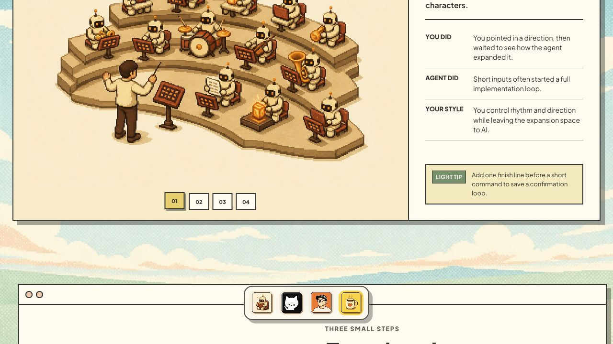
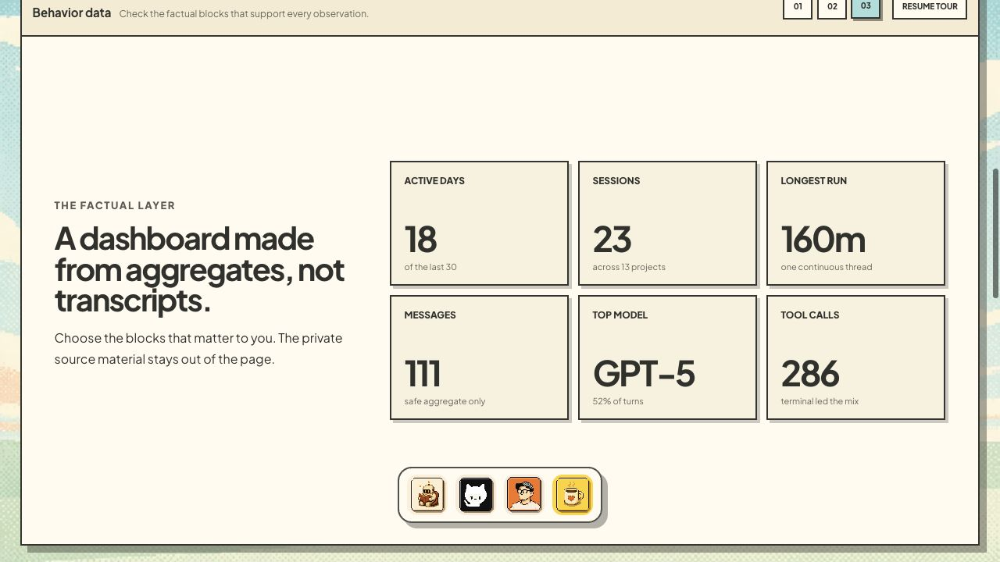

# Coding Wrapped Preview UX Audit

审查对象：`https://coding-wrapped.sunless77.workers.dev/#demo`

## 结论

Preview 的视觉与内容已经足够有辨识度。当前主要摩擦不是“不够好看”，而是三套导航同时出现：顶部三页签、导览 01–03、洞察 01–04。用户需要先理解这些控件之间的关系，真正有趣的切换反馈又位于折叠线以下。

最值得做的调整，是把 Preview 改成一段 20–30 秒就能看懂的 guided story：明确告诉用户这里可以操作；每次只突出一个下一步；点击后立即看到图像、数字和故事一起变化。

## 体验步骤

### 1. 进入 Preview：一般

Hero 的叙事完整，但 Preview 在首屏底部只露出浏览器边框，容易被理解成下一屏的一张静态截图。建议在浏览器边框上加入 `LIVE DEMO · CLICK TO EXPLORE`，进入视口时轻微放大并高亮第一个页签。



### 2. Overview：良好，但导航重复

Overview 的文字和像素插图有很强的第一印象。不过顶部页签和 01–03 导览表达的是同一层级，用户不知道应当点击哪一组。保留顶部页签作为主导航，把 01–03 收敛成一条导览进度：`Tour 1 of 3 · Overview`、进度条、`Next`、`Pause`。



### 3. Insight deck：内容强，操作反馈偏晚

这是 Preview 最有吸引力的部分，但洞察 01–04 的切换按钮位于卡片底部。用户必须滚动后才能发现还有三张；切换以后仍停留在页面底部，看不到新标题，削弱了“下一张故事”的奖励感。

建议把 01–04、上一张、下一张移到右侧标题旁并保持可见；切换时让内容区回到标题位置，图像、关键数字、建议依次在 180–250ms 内出现。





### 4. Behavior data：清晰，但互动目标不足

数据卡片易读，能够证明洞察来自事实层。但它更像陈列，不像可探索模块。建议默认只突出 3 个核心指标，其余卡片通过 `Customize metrics` 展开；hover 时显示一句解释或时间范围，不需要增加复杂图表。



## 推荐的信息结构

```text
[ Browser header ]
[ Overview | Insight deck | Behavior data ]      [ Use my own data ]
[ Tour 1 of 3 · See your pattern ]  ███░░  [ Pause ] [ Next ]

[ Illustration / metric ]  [ Insight 1 / 4   ←  01 02 03 04  → ]
                           [ Title + key fact ]
                           [ You did / Agent did / Your style ]
                           [ Light tip ]
```

## 优先级

1. **P0：让 Preview 明确可交互。** 增加 Live Demo 提示和一次性的焦点引导。
2. **P0：合并重复导航。** 顶部页签负责直接跳转，导览只负责解释下一步。
3. **P0：把洞察切换放到标题旁。** 用户不需要滚动就能发现并切换四张故事。
4. **P1：Preview 出现时让底部 Dock 进入 quiet mode。** 缩小、移到右下或降低透明度，避免遮挡插图和下一段标题。
5. **P1：把切换做成短促的故事节奏。** 数字先出现，插图随后变化，最后显示建议；不要增加大幅运动。
6. **P1：把 `SCAN FACT DATA` 改成结果导向的 `Use my own data`。** 点击后进入安装说明或生成路径，而不是像一个不确定的扫描动作。

## 可用性注意

- 用户操作后应暂停自动导览；不要几秒后自动抢回控制权。
- 支持键盘方向键与左右滑动切换洞察。
- 保留清晰的 focus 状态，切换结果用 `aria-live` 告知辅助技术。
- 遵循 `prefers-reduced-motion`，把动画降级为淡入。
- 从截图无法确认完整的键盘路径、对比度和读屏行为，需要另做交互测试。

